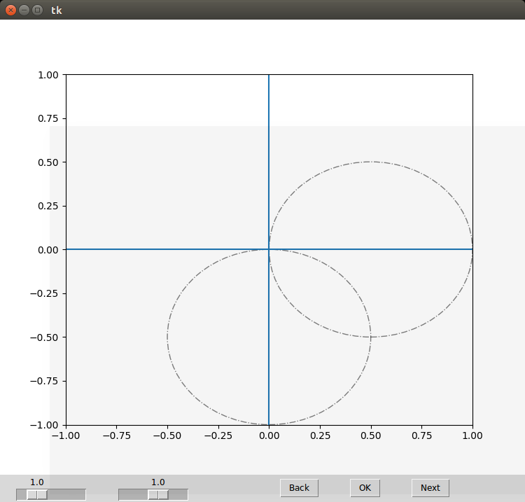
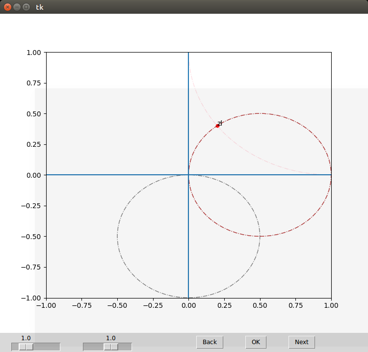
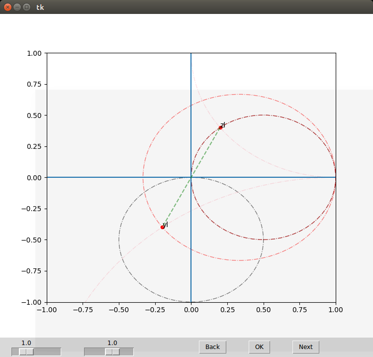
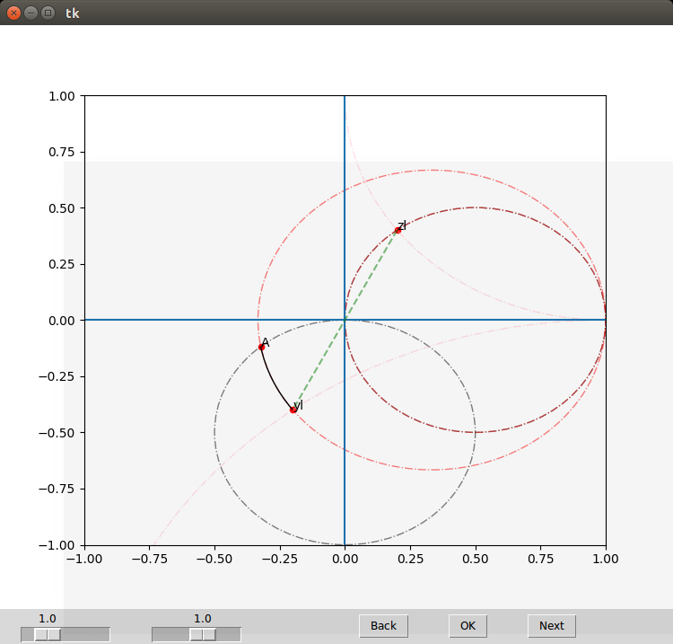
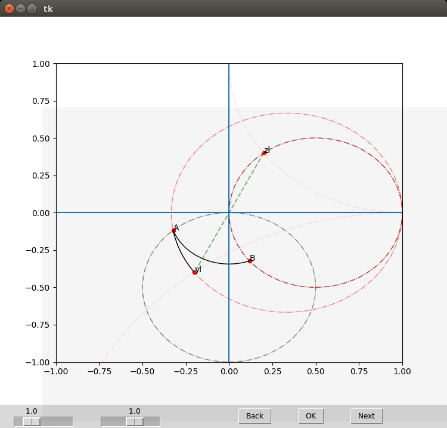
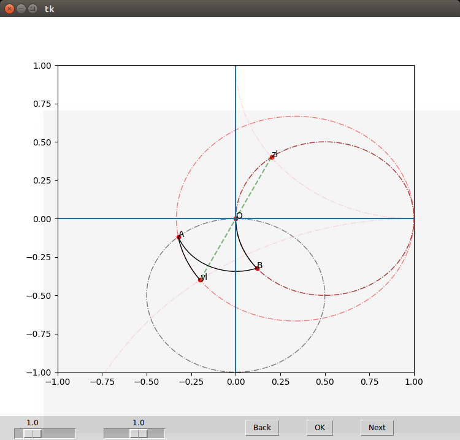

## 这是什么
本来是射频的一次作业, 通过SmithChart来演示双支节匹配, 之前做带界面的程序比较头疼, 这次铁了心的要用MVC架构, 做出一个模板

## 使用方法
	`python3 Control.py`  

## 依赖环境
	* matplotlib -- 绘图
	* tkinter -- 界面
	* numpy,math, cmath -- 运算

## 框架说明
```
        BaseModel[figure, State Machine] BaseView[Base Frame]
            |                                   |
            |                                   |
            v                                   v
Point--->Model[函数序列]                    View[特殊控件]
[针对Smith  |                                   |
的特殊类]   |                                   |
            |                                   |
            ------------>Contorl<---------------- 
			      [行为触发,参数传递]
```
## 函数序列(状态机)
```
        pre-->zl-->yl-->a-->b-->o
------------------------------------
point |       T    T    T   T   T      
line  |            T                  
arc   |                 T   T   T    
smith |       T    T                  
assis | T                             
```
## 运行状态截图
 
 
 
 
 
 

